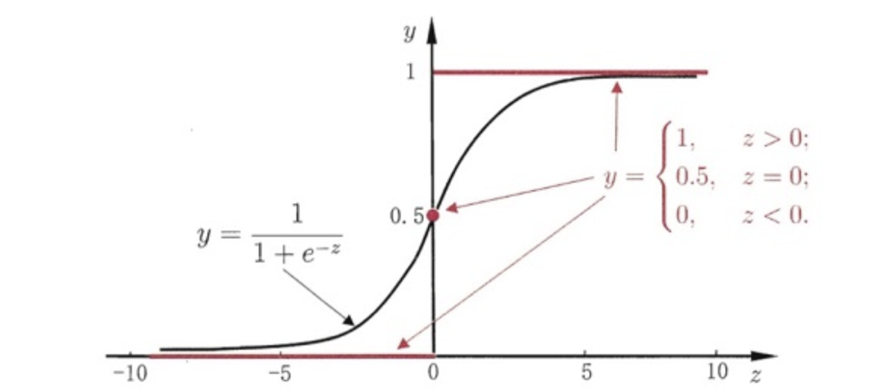

# 西瓜书复习笔记03
- **线性模型：**
    - 如何判断线性模型：
        主要是看一个乘法式子中自变量x前的系数w，如果w只影响一个x，那么此模型为线性模型。
        或者判断决策边界线是否为直线。
- **线性回归：**
    - 什么是线性回归：
    线性回归试图学得一个线性模型尽可能的准确预测输出值。
    - 特征处理：
        - 连续值不作处理。
        - 离散值可以通过连续化变为连续值。
        （‘高’，‘中’，‘矮’可转化为{1.0， 0.5， 0.0}）
    - 均方误差：
         $$ E(f ; D)=\frac{1}{m} \sum_{i=1}^{m}\left(f\left(\boldsymbol{x}_{i}\right)-y_{i}\right)^{2} $$
    - 最小二乘法：
        基于均方误差最小化来进行模型求解，试图找到一条线使所有样本到直线上的欧式距离之和最小。
    - 最小化损失函数：
        $$ \underset{(w, b)}{\arg \min } \sum_{i=1}^{m}\left(y_{i}-w x_{i}-b\right)^{2} $$
    - 求解过程：
        - 一元线性回归可以将E分别与w和b求导，然后令两个式子为0，可得到w和b的最有闭式解。（最小二乘法）
        - 多元线性回归，同样可以使用最小二乘法，对每个wi求偏导，使所有式子为0，最后解矩阵方程组。但高维数据很难计算。（最小二乘法）
        - 多元线性回归求最小化损失函数最常用的是梯度下降法。
- **梯度下降：**
    - 什么是梯度下降：
        在求解损失函数的最小值时，可以通过梯度下降法来一步步的迭代求解，得到最小化的损失函数和模型参数值。
    - 梯度下降流程：
        初始化损失函数的参数w，根据梯度下降的步长更新参数w，重复这个过程一直到无法更新（梯度为0），获得最优解。
    - 最优解：
        梯度下降法不一定能求得全局最优解，有可能是一个局部最优解。但是如果损失函数是凸函数那么结果一定是最优解。
    - 迭代更新：
        $$ w_{n e w}=w_{t}-\alpha \nabla E(w,b)=w-a \frac{\partial E(w, b)}{\partial w} $$
        下一时刻的权重等于这一时刻的权重减去学习率乘以损失函数对wi的梯度。所有权值W是一起更新的。
    - 学习率：
        α的取值范围(0,1]。
        如果学习率太小，增加收敛的迭代次数，使系统的算力负荷。
        如果学习率太大，那么可能会在最小值旁边震荡，无法收敛。
    - 如何去确定学习率：
        - 网格搜索：设定迭代次数，设定几个参数比较结果，但计算量大。
        - 梯度限制：设定大量迭代，当梯度向量变的小于某个值时停止。
    - 梯度下降的方向：
        朝最优点方向，也就是斜率的反方向，也就是负梯方向更新。
    - 初始值怎么选择：
        离最优点越近越好，减少收敛的迭代次数。
    - 几种梯度下降的方法：
        - 批量随机下降：
            每一次迭代时使用所有样本来进行梯度的更新。
            优点：更准确的朝极值所在方向。
            缺点：算力负荷。
        - 随机梯度下降：
            每次迭代使用一个样本来对参数进行更新。在局部最优点梯度仍然不为0，可以跳出局部最小继续搜索。
            优点：训练速度快。
            缺点：准确度下降，可能收敛到局部最优。
        - 小批量梯度下降：
            每次迭代 使用batch_size个样本来对参数进行更新。
    - 跳出局部最优点的方法：
        - 模拟退火
        - 神经网络中初始化不同的参数，取其中误差最小的解作为最终参数。
        - 随机梯度下降。
- **逻辑回归（LR）：**
    - 什么是逻辑回归：
        对于二分类问题，逻辑回归算法就是在样本数据中寻找一个超平面，然后把样本数据分割成不同的类别，并且能对新数据进行分类。
    - 输出标签：
        二分类问题，标签为{0,1}
    - 特征处理：
        连续值离散化。
        离散值不作处理。
    - 为什么要对特征进行离散化：
        将连续值离散为一系列0、1特征交给逻辑回归模型
        - 非线性：逻辑回归属于广义线性模型，表达能力受限，将特征离散化为N个后，每个变量都有单独的权重，相当于引入非线性，加大拟合能力。
        - 鲁棒性：对异常数据有特别强的鲁棒性。例如身高大于例如1.7m为1，那么异常数据5m就不会对模型造成很大干扰。
        - 速度快：稀疏向量计算内积速度快。
    - Sigmoid函数：
        - 
        - Sigmoid函数良好的性质：
            Sigmoid可以将样本点映射到（0，1）区间内
        Sigmoid函数连续可导
    - 手推LR：
        - 构造假设函数：
            h(x)表示样本预测为正例的概率：
            $$h_w(x)=\frac{1}{1+e^{-w^{\top} x}}$$
            有：
            $$\left\{\begin{array}{l} p(y=1 | x)=h_{w}(x) \\ p(y=0 | x)=1-h_{w}(x)\end{array}\right.$$
            合并：
            $$ P(y | x)=( h_{w}(x))^{y} \cdot(1-h_{w}(x))^{1-y} $$
        - 构造损失函数
            服从伯努利分布，用极大似然估计w和b
            极大似然：
                $$ L(w)=\prod_{i=0}^{m} P\left(y_{i} | x_{i}\right)=(h_{w}\left(x_{i}\right))^{y_{i}} \cdot\left(1-h_{w}\left(x_{i}\right)\right)^{1-y_{i}} $$
            对数极大似然：
                $$
                \ln L(w)=\sum_{i=0}^{m} y_{i} \ln\left(h_{w}\left(x_{i}\right)\right)+\left(1-y_{i}\right)\ln \left(1-h_{w}\left(x_{i}\right)\right)
                $$
            求极大似然，等价于最小化：
                $$ \operatorname{loss}(w)=-\frac{1}{m} \ln L(w) $$
            损失函数：
                $$ \operatorname{loss}(w)=-\frac{1}{m} \sum_{i=0}^{m} y_{i} \ln\left(h_{w}\left(x_{i}\right)\right)+\left(1-y_{i}\right)\ln \left(1-h_{w}\left(x_{i}\right)\right)$$
        - 损失函数优化
            求解：
                $$
                \boldsymbol{w}^{*}=\underset{\boldsymbol{w}}{\arg \min } \ell({w})
                $$
            最小化损失函数：
            - 梯度下降（同上）
            - 牛顿法:
                $$
                w^{t+1}=w^{t}-\left(\frac{\partial^{2} \ell(w)}{\partial w \partial w^{\mathrm{T}}}\right)^{-1} \frac{\partial \ell(w)}{\partial w}
                $$
                
            正则化：
            - L1正则:
                $$ \min _{w} \operatorname{loss}(w)+\alpha\|w\|_{1} $$
            - L2正则:
                $$ \min _{w} \operatorname{loss}(w)+\alpha\|w\|_{2}^2 $$
    - 为什么逻辑回归加了Sigmoid依然是线性模型，而BP神经网络加了Sigmoid之后变成了非线性模型：
        LR中的Sigmoid函数只是将实值转化为0/1值（只是映射到0-1区间之内）。
        然而BP神经网络中的激活函数确实可以带来非线性。神经网络的每一个节点都是一个LR模型，下一层的变量x可能受上一层的权重影响，因此模型呈现非线性。
        https://www.cnblogs.com/toone/p/8574294.html
- **线性判别分析（LDA）**
    - 