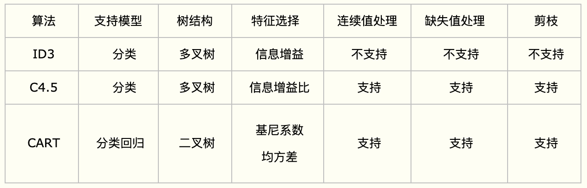

# 西瓜书复习笔记04
- **决策树：**
    - 什么是决策树：
        决策树就是在训练集中用树结构学习一个模型，用来对新的示例进行分类。
    - 训练决策树的递归返回条件：
        - 样本集D中所有类别都属于同一类别，将node标记为叶节点，返回。
        - 当前属性集A为空，将node标记为叶节点，返回。
        （虽然D中类别不同，但是已经没有属性可以划分了）
        - 当前节点的样本集为空，将分支节点标记为叶节点，返回。
    ~~- 每次划分完属性，\(a_i\)要从属性集A中去除。~~
- **划分选择：**
    - 主要思想：
        每一次节点划分，都希望分支节点所包含的样本基本属于同一类。
    - ID3（信息增益）：
        - 什么是熵：
            熵是用来形容一种事物的混乱程度。
            （例如有10个人，左边区域有5个右边区域有5个，这时候最混乱，熵就最大；
            但是如果左边区域有10个人，而右边区域没有人，这时候最纯，熵就最小。）
        - 什么是信息熵：
            信息熵就是度量样本集和纯度的一种指标。
                $$ \operatorname{Ent}(D)=-\sum_{k=1}^{|\mathcal{Y}|} p_{k} \log _{2} p_{k} $$
            其中：
                k表示第几类样本；
                \(p_k\)表示在k标签在样本集D中所占比例。
            意义：
                信息熵Ent(D)越小，代表D的纯度越高。
        - 如何计算信息增益：
                $$ \operatorname{Gain}(D, a)=\operatorname{Ent}(D)-\sum_{v=1}^{V} \frac{\left|D^{v}\right|}{|D|} \operatorname{Ent}\left(D^{v}\right) $$
            最优划分：
                $$ a_{*}=\underset{a \in A}{\arg \max } \operatorname{Gain}(D, a) $$
            其中：
                a表示用属性a来划分当前样本集D；
                V表示通过a来划分的节点的个数；
                \(D^{v}\)表示取值为\(a^{v}\)的样本。
            意义：
                信息增益越大，代表着属性a划分的样本集约纯。
    - C4.5（信息增益率）：
        - 已有ID3（信息增益），为什么还要计算C4.5（信息增益率）：
            ID3对取值数较多的属性有所偏好，多个分支导致每个分支纯度最大，这样的决策树不具备有效的泛化能力。
        - 如何计算信息增益率：
                $$ \operatorname{GainRatio}(D, a)=\frac{\operatorname{Gain}(D, a)}{\mathrm{IV}(a)} $$
            其中：
                $$ \operatorname{IV}(a)=-\sum_{v=1}^{V} \frac{\left|D^{v}\right|}{|D|} \log _{2} \frac{\left|D^{v}\right|}{|D|} $$
                IV(a)被称为属性a的固有值，随着V的增大而增大，导致信息增益率会减小。
        - 配合使用：
            由于信息增益率会对较少属性的有所偏好，可以先使用ID3划分规则找出信息增益高于平均水平的属性，再从这群属性里面选择信息增益率最大的。
    - CART：
        CART是个二叉树！与ID3、C4.5不同，特征只参加一次节点划分。
        - CART分类树：
            - 特征处理：
                - 连续值：
                    与ID3、C4.5一样，将连续的特征离散化。选择阈值，例如特征\(a_i\)有m个连续值，设置m-1个阈值，阈值计算为相邻两数的平均。（与ID3、C4.5处理离散属性不同的是，如果当前节点为连续属性，则该属性在后面还可以参与子节点的产生选择过程。）
                - 离散值：
                    由于是二叉树，所以要对离散值进行组合。例如一特征有3个离散值{A1, A2, A3}， 不断使用二分法形成{A1, A2A3}、{A2, A1A3}和{A3, A1A2}。（这和ID3或者C4.5不同，在ID3或者C4.5的一棵子树中，离散特征只会参与一次节点的建立。）
            - 叶节点：
                每一片叶子代表有限类中的一个。
            - 基尼指数：
                    $$ \operatorname{Gini}(D, a)=1-\sum_{k=1}^{|\mathcal{Y}|} p_{k}^{2}$$
                属性a的基尼指数：
                    $$ \operatorname{ GiniIndex }(D, a)=\sum_{v=1}^{V} \frac{\left|D^{v}\right|}{|D|} \operatorname{Gini}\left(D^{v}\right) $$
                最优划分：
                    $$ a_{*}=\underset{a \in A}{\arg \min } \operatorname{GiniIndex}(D, a) $$
                其中：
                    a表示用属性a来划分当前样本集D；
                    V表示通过a来划分的节点的个数；
                    \(D^{v}\)表示取值为\(a^{v}\)的样本。
                意义：
                    Gini(D)反映了从数据集中随机抽取两个样本，其标记类别不一致的概率。因此不一致的概率越低，数据集纯度越高。
        - CART回归树：
            - 特征处理：
            - 叶节点：
                每一片叶子代表所含数据集元素的均值。
            - 最小化MSE：
                    $$ \underbrace{\min }_{A, s}\left[\underbrace{\min }_{c_{1}} \sum_{x_{i} \in D_{1}(A, s)}\left(y_{i}-c_{1}\right)^{2}+\underbrace{\min }_{c_{2}} \sum_{x_{i} \in D_{2}(A, s)}\left(y_{i}-c_{2}\right)^{2}\right] $$
                其中：
                    c1为D1的样本输出均值，c2为D2的样本输出均值；
                    s为划分点；
                    A为划分特征。
                意义：
                    度量目标是对于划分特征A，对应划分点s两边的数据集D1和D2，求出使D1和D2各自集合的均方差最小，同时D1和D2的均方差之和最小
            - 划分停止条件：
                节点的个数；
                到达某一深度；
            - 为什么ID3和C4.5不能做回归：
                因为它们是用信息增益和信息增益率做节点划分的，而不是最小化MSE。
            - CART回归与CART分类的差异：
                CART回归：
                    用最小化MSE作为节点划分依据；
                    叶子代表预测的连续值（叶子节点内的均值）。
                CART分类：
                    用基尼指数作为特征选择依据；
                    叶子代表被分类的类别（叶子节点内概率最大的类别）。
            - SkLearn里默认用CART生成决策树，为什么：
                CART是二叉树，而ID3和C4.5是多叉树，二叉树有利于计算
                Gini指数比信息增益好计算，因为是二次计算VS对数计算
    - 三种划分规则对比：
        - 

- **剪枝处理：**