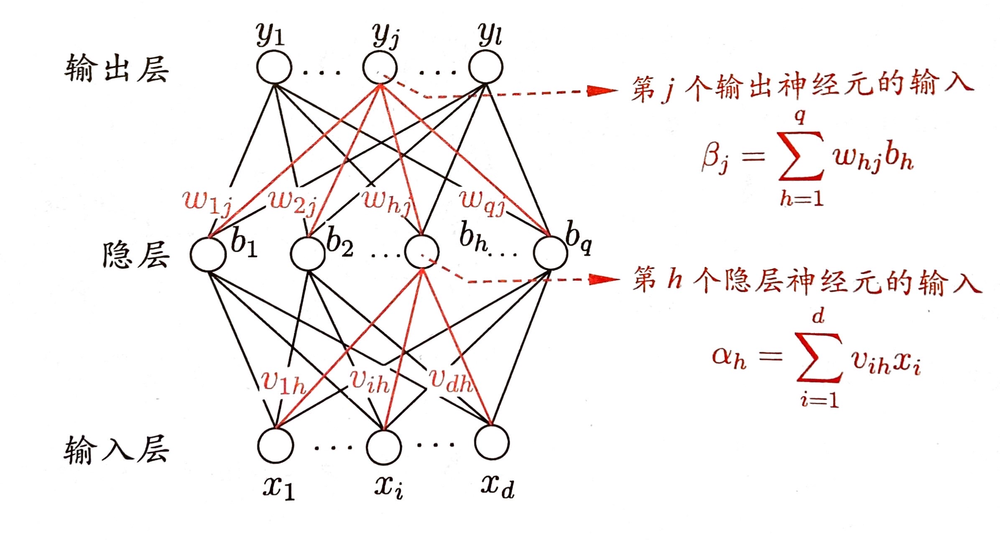
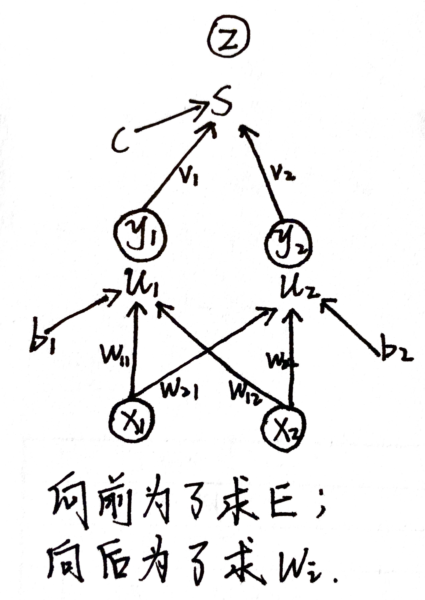
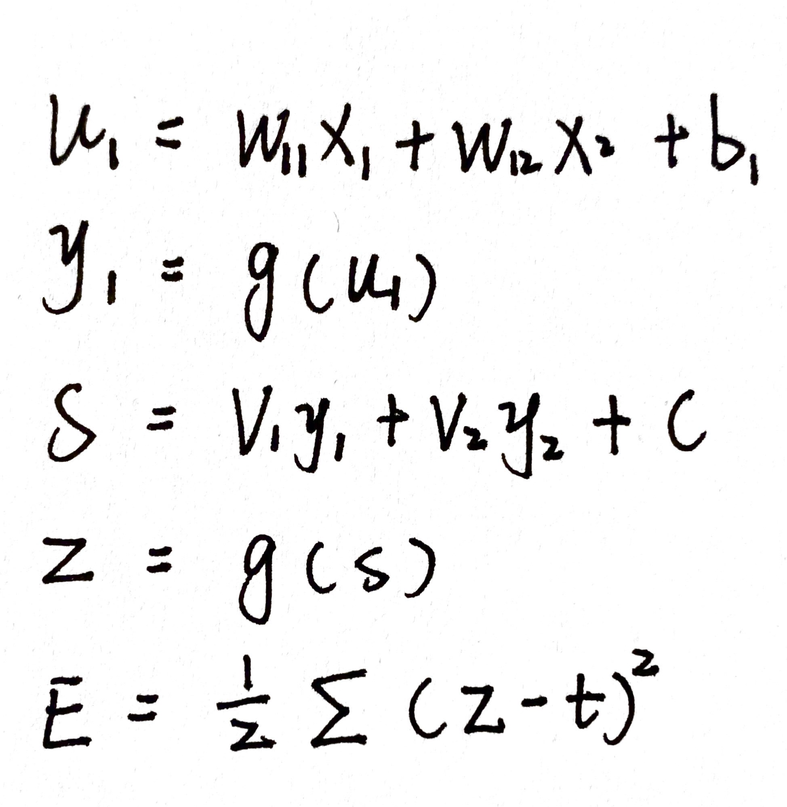
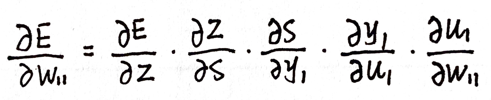
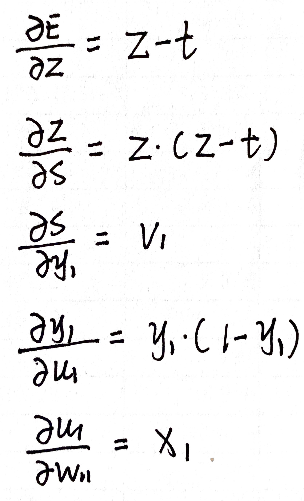

# 西瓜书复习笔记05
- **神经元模型：**
    - 激活函数：
        - 阶跃函数：
            - 理想的激活函数，对应输出值为0或1，其中0应对神经元抑制，1应对神经元兴奋
            - 缺点：不连续不光滑
        - Sigmoid：
            - 将较大范围的输出值挤压到\((0,1)\)输出值范围内
    - bias：
        - 如果某神经元电位超过了bias，那么将被“激活”，向其他神经元发送化学物质
        - 如果某神经元电位低于bias，那么将被“抑制“
- **感知机与多层网络：**
    - 感知机：
        - 什么是感知机：
            - 感知机由两层神经元组成，输入层接受外界输入信号传给输出层，输出层是M-P神经元。
        - 什么是神经网络学习：
            - 就是根据训练数据，来调整神经元之间的连接权以及每个功能神经元的阈值。
        - 感知机权重更新：
            $$ w_{i} \leftarrow w_{i}+\Delta w_{i} $$
            $$ \Delta w_{i}=\eta(y-\hat{y}) x_{i} $$
            其中
                \(\eta\)是学习率；
                若预测正确，感知机不发生变化，即\((y = \hat{y})\)；
                若预测错误，感知机要进行权重调整\((y \neq \hat{y})\)。
        - 收敛：
            - 感知机的学习过程使得权重向量趋于稳定。
        - 限制：
            - 感知机学习能力有限，只能解决与、或、非问题（线性问题）；
                但是不能解决像异或（非线性问题）。
        - 非线性可分：
            - 用线性超平面无法划分
        - 解决非线性问题：
            - 使用多层神经元，简单的两层感知机就能解决异或问题，即在输入层和输出层之间加入一层隐藏层（包含两个神经元，带激活函数）。
        - 多层前馈神经网络：
            - 每层神经元与上下一层神经元全互连，神经元之间不存在同层连接，也不存在跨层连接。
- **误差逆传播算法（反向传播，BP）：**
    - 什么是BP：
        - 从最后一层开始，利用广义的感知机学习规则，基于梯度下降策略，以目标的负梯度方向对参数进行调整。
    - BP的过程：
        1. 对每个训练样例，先将输入示例提供给输入层神经元，然后逐层将信号前传；
        2. 预测产生输出层结果，计算输出层误差；
        3. 将误差逆向传播至隐层，根据隐层神经元的误差来对连接权和阈值进行调整；
        4. 迭代循环进行，直到某些条件（如训练误差已经很小）停止。
    - BP算法的目的：
        - 不断的调节连接权，使最小化训练集上的累积均方误差。
    - BP算法权重更新：
        - 网络结构：
            
        - 神经网络输出：
            $$ \hat{y}_{j}^{k}=sigmoid\left(\beta_{j}-\theta_{j}\right) $$
            其中：
            \(\theta_{j}\)表示阈值。
        - 网络上的均方误差：
            $$ E_{k}=\frac{1}{2} \sum_{j=1}^{l}\left(\hat{y}_{j}^{k}-y_{j}^{k}\right)^{2} $$
            其中：
            \(l\)表示输出层神经元的个数。
        - 连接权更新：
            $$ w_{hj} \leftarrow w_{hj}+\Delta w_{hj} $$
            $$ \Delta w_{h j}=-\eta \frac{\partial E_{k}}{\partial w_{h j}} $$
            基于梯度下降策略，以目标函数的负梯度方向对参数进行调整。
        - 链式法则（chain rule）：
            $$ \frac{\partial E_{k}}{\partial w_{h j}}=\frac{\partial E_{k}}{\partial \hat{y}_{j}^{k}} \cdot \frac{\partial \hat{y}_{j}^{k}}{\partial \beta_{j}} \cdot \frac{\partial \beta_{j}}{\partial w_{h j}} $$
        - 例题：
        
        
    - sigmoid函数：
        - 每个隐藏层和输出层之间都有一个sigmoid函数。
        - sigmoid一个很好的性质：
            $$ f^{\prime}(x)=f(x)(1-f(x)) $$
    - 学习率：
        - 学习率太大容易震荡，太小收敛速度慢
        （具体参考西瓜书复习笔记02）
    - One Epoch:
        - 读取训练集一遍称为进行了一轮学习
    - 标准BP算法：
        - 每次更新只针对于单个样例，参数更新频率高（随机梯度下降）
        - 缺点：不同样例之间出现抵消现象
    - 累积BP算法：
        - 读取完整个训练集D后，才对参数进行更新，参数更新频率低（批量随机下降）
        - 缺点：累积误差下降到一定程度后，进一步下降速度慢
    - 过拟合怎么处理：
        - 正则化
        - 早停：
            训练集误差降低，验证集误差增高，停止；或达到预定轮数停止。
        - dropout
- 局部最小与全局最小：
    
