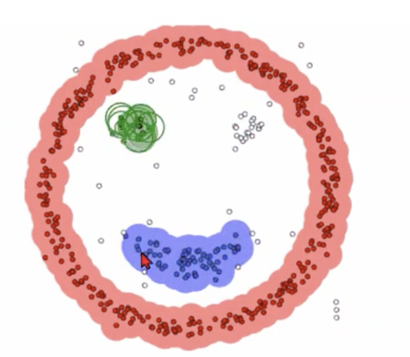

# 西瓜书复习笔记09
- **聚类任务：**
    - 什么是聚类：
        聚类就是试图将数据集的样本划分为若干个通常是不相交的子集每个子集成为一个蔟。
    - 应用：
        商家判定客户类型，定向推送。
        先用用户数据进行聚类，每个蔟定为一个类，再基于这些类训练分类模型，判别新用户的类型。
        所以聚类可以作为单独的过程，用于寻找数据内在的分布结构；也可以作为辅助作用，为其他学习算法做前驱过程。
    - 聚类的性能度量：
        - 外部指标：
            将聚类结果与某个参考模型进行比较；
            若C为假定通过聚类给出的蔟划分，C*为参考模型给出的蔟划分。
            $$ \begin{array}{l}a=|S S| \\ b=|S D| \\ c=|D S| \\ d=|D D|\end{array} $$
            a表示在样本C在C*的数量，b表示在C不在C\*中，c表示在不在C在C\*中，D表示不在C也不在C\*中。
            Jaccard系数：
            $$ \mathrm{JC}=\frac{a}{a+b+c} $$
            上述性能度量的结果均值在[0,1]区间内，越大越好。
        - 内部指标：
            直接考察内部结果而不采用任何参考模型。
            DBI指数：
            $$ \mathrm{DBI}=\frac{1}{k} \sum_{i=1}^{k} \max _{j \neq i}\left(\frac{\operatorname{avg}\left(C_{i}\right)+\operatorname{avg}\left(C_{j}\right)}{d_{\operatorname{cen}}\left(C_{i}, C_{j}\right)}\right) $$
            avg(C)是应于蔟C内样本间的平均距离。
            dcen(Ci,Cj)是对应蔟Ci和Cj中心点间的距离。
            DBI越小越好
    - 距离计算：
        衡量两个样本之间的相似性
        - 闵可斯基距离（Lp范数）：
            - 曼哈顿距离：
            应用：二维地图导航，从初始点阿斗目标点。
            - 欧式距离：
            应用：二维空间内的直线距离
            - 切比雪夫距离：
            - 闵可斯基距离只能用于有序属性，对于无序属性怎么做：
                VDM
                将两者结合可以处理混合属性。
        - 相似度量（similarity）：
            距离越大相似度越小。
- **原型聚类：**
    - 假设聚类能形成一定的原型刻画
    - k均值算法（k-means）：
            $$ E=\sum_{i=1}^{k} \sum_{x \in C_{i}}\left\|x-\mu_{i}\right\|_{2}^{2} $$
        其中：
            \(\mu_{i}\)为均值向量。
        采用算法使所有蔟的平方误差和最小，E越小说明蔟内相似度越高。
        - 流程：
            1. 开始选择k个点作为中心点；
            2. 计算所有点与中心点的距离，离谁近归谁的原则划分好k个聚类；
            3. 在这k个聚类中再计算出新的中心点（均值向量）；
            4. 不断重复这个过程，直到中心点不再更新。
        优点：
            原理简单，收敛速度快
        缺点：
            需要事先确定k的值；
            （改进：先用较大的k训练一次，合并距离近的中心点，在用新的k训练一次kmeans）
            对噪音和异常点敏感（事先随机初始点）；
            （kmeans++）
    - k-means++:
        解决了kmeans初始点的选取影响结果的问题，解决了异常点问题。
        流程：
            1. 先随机选一个点作为中心；
            2. 计算每个点与中心点的距离，用D(x)表示；用\( \frac{D(x)^{2}}{\sum_{x \in X} D(x)^{2}}\)转为概率，放入轮盘，用轮盘选择法选出下一个聚类中心。（离中心点越远的越可能被选中）
            3.一直重复上一步，直到选出k个中心。
    - 学习向量量化(LVQ):
        流程：
            1. 假设每个样本都带有类别，给每个类随机给一个原型向量
            2. 随机选择一个样本，计算它与所有原型向量的距离
            3. 选择距离最近的原型向量
            4. 如果yi是这个原型向量代表的类，那么
                $$ \quad {p}^{\prime}=p_{i^{*}}+\eta \cdot\left(x_{j}-p_{i^{*}}\right) $$
                否则：
                    减去
- **密度聚类：**
    DBSCAN：
        1. 假设聚类结构能通过样本分布的紧密程度来确定；
        2. 那么先选一个点，将它的邻域归为一类，然后一直寻找这个邻域直到重合；
        重复这个方法。最后将没有邻域的点定位离群点。
    
- **层次聚类：**
    自底向上的一种聚类方式
    - AGNES：
        1. 开始将数据集中每一个样本看作是一个蔟；
        2. 然后根据合并规则将距离最近的蔟进行合并；
        3. 一直重复直到合并到预定k大小的聚类
    - 合并策略：
        最小距离（单链接）
        最大距离（全链接）
        平均距离（均链接）
    - 如果k=1：
        则最终产生一个蔟。可以根据算法生成的树状图按需求划分类别。
